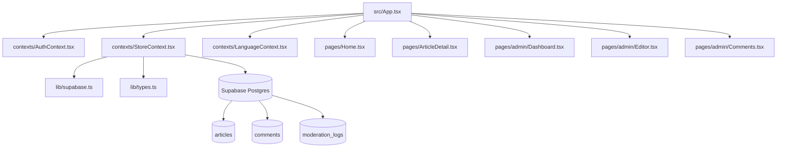
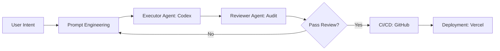

 # Digital Editorial Journal

A React + Vite + Supabase digital editorial project with public reading, comments, admin CMS, moderation logs, and realtime sync.

## Features

- Public article browsing and detail pages
- Comment posting
- Admin login and CMS (create/update/delete articles)
- Comment moderation with audit logs (`moderation_logs`)
- Supabase Realtime sync for articles, comments, and moderation logs

## Tech Stack

- React 19
- TypeScript 5
- Vite 7
- Tailwind CSS 4
- Supabase JS 2
- Wouter (hash routing)
- Vitest + ESLint

## Quick Start

### 1. Install dependencies

```bash
pnpm install
```

### 2. Configure environment variables

Create `.env` in the project root:

```env
VITE_SUPABASE_URL=your_supabase_project_url
VITE_SUPABASE_ANON_KEY=your_supabase_anon_key
```

### 3. Run locally

```bash
pnpm dev
```

### 4. Build

```bash
pnpm build
```

## Database Setup (Supabase)

Run SQL scripts in this order inside Supabase SQL Editor:

1. `supabase_schema.sql`
2. `update_schema_moderation.sql`

This creates:

- Tables: `articles`, `comments`, `admin_users`, `moderation_logs`
- Functions: `is_admin()`, `increment_article_likes()`, `delete_comment_with_log()`
- RLS policies
- Realtime publication config

## Admin Setup

Grant admin role by inserting user id into `admin_users`:

```sql
insert into public.admin_users (user_id)
values ('<auth.users.id>');
```

## Scripts

```bash
pnpm dev
pnpm build
pnpm preview
pnpm lint
pnpm test
```

## Open Source Collaboration

- Contribution guide: `CONTRIBUTING.md`
- Security policy: `SECURITY.md`
- Code ownership: `.github/CODEOWNERS`
- Issue templates: `.github/ISSUE_TEMPLATE/`
- Pull request template: `.github/pull_request_template.md`

## CI and Automation

- CI pipeline (`.github/workflows/ci.yml`) runs lint, tests, and build on push/PR.
- Dependency review (`.github/workflows/dependency-review.yml`) checks dependency risk on PRs.
- CodeQL (`.github/workflows/codeql.yml`) runs static analysis for JS/TS.
- Dependabot (`.github/dependabot.yml`) opens weekly dependency update PRs.

## Architecture (Code Structure)



## AI-Native Workflow

This project follows the workflow below for iterative delivery and quality control.



## Notes

- The app uses hash routing (`/#/...`) for static hosting compatibility.
- Frontend must only use `VITE_SUPABASE_ANON_KEY`.
- Authorization is enforced by Supabase RLS, not by UI visibility alone.
